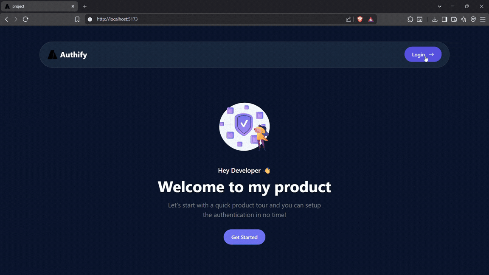
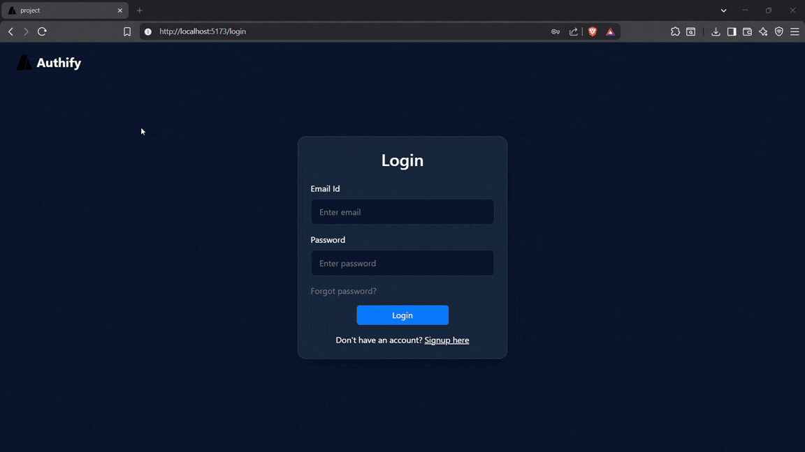

# Authify Frontend – Authentication System UI

Authify Frontend is a React-based user interface for the **Authify authentication system**. It provides pages for user registration, login, and protected routes, communicating with the backend using REST APIs and **JWT authentication**.

This project demonstrates how to build a modern authentication frontend using React and API integration.

---

## Features

- User registration
- Secure login system
- Logout functionality
- Protected routes using authentication context
- Toast notifications for user feedback
- API integration with authentication backend
- Responsive UI using Bootstrap

---

## Tech Stack

- **Frontend:** React, React Router, Axios, Bootstrap
- **Language:** JS, CSS, HTML
- **API Style:** RESTful APIs

---

## Project Structure

```text
src
├── assets        → Images and static files
├── components    → Reusable UI components
├── context       → Authentication context
├── pages         → Application pages
├── util          → Utility functions
│
├── App.jsx
├── main.jsx
└── index.css
```

---

## Backend Integration

This frontend works with the **Authify Backend API**:

- Backend repository: `https://github.com/rarestpreet/Authify_Backend`

The frontend communicates with the backend using **Axios** for API requests and manages authentication using **JWT tokens**.

---

z## Demo

- The gif below shows a `user` loging in:

  

- The gif below shows an `admin` loging in:

  

## Installation

### 1️. Clone the repository

```bash
git clone https://github.com/rarestpreet/Authify_Frontend.git
```

### 2️. Install dependencies

```bash
npm install
```

### 3️. Start the development server

```bash
npm run dev
```

The application will run at:

- `http://localhost:5173`

Make sure the backend is running (commonly):

- `http://localhost:8080`

---

## Authentication Flow

1. User enters login credentials
2. Frontend sends request to backend API
3. Backend validates user and returns a JWT token
4. Token is stored in the client (Http-cookies)
5. Token is attached to future API requests (e.g., `Authorization: Bearer <token>`)
6. Protected routes are accessible only to authenticated users

---

## Learning Objectives

This project demonstrates:

- React authentication flows
- API integration using Axios
- Protected routes with React Router
- State management using Context API
- Building UI with Bootstrap

---

## Future Improvements

- Refresh token support
- Dark mode UI
- Role-based access control
- Deployment using Docker
